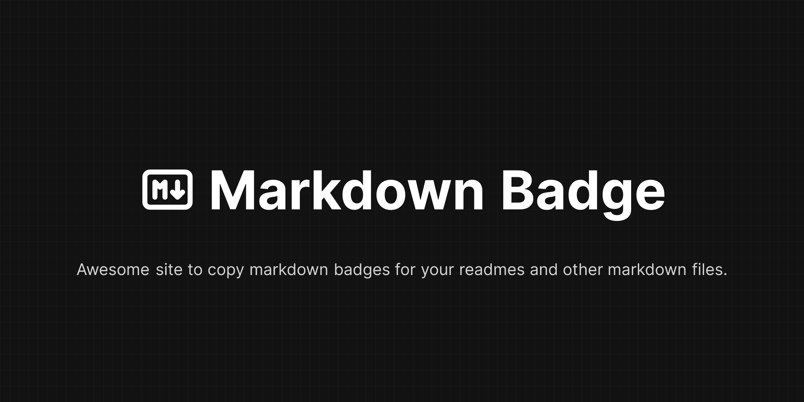

<a href="#overview">Overview</a>
•
<a href="#contribute-to-the-project">Contribute to the project</a>

## Overview

Awesome site to copy markdown badges for your readmes and other markdown files.
This project is a simple tool to search and copy markdown badgets to use in your profile or projects.  
All badges provided by this project were extracted from
<a href="https://github.com/Ileriayo/markdown-badges"				target="_blank">Ileriayo/markdown-badges GitHub repository</a>
, which come from <a href="https://shields.io/" class="underline" target="_blank">shields.io</a>.

## Contribute to the project

Please consult our [contribution guide](./CONTRIBUTING.md) to find out how you can get started in the best way and by following good practices.
